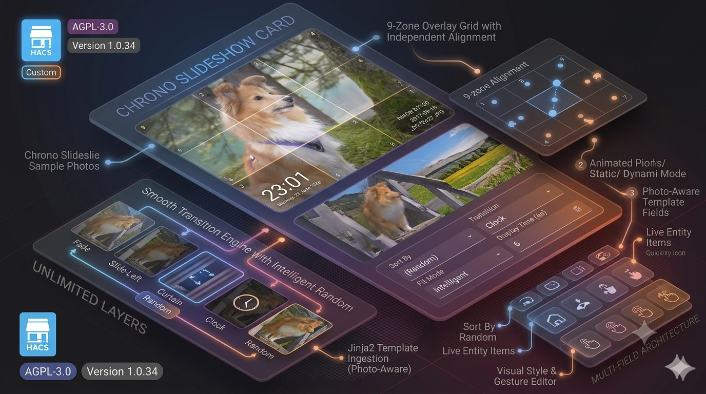
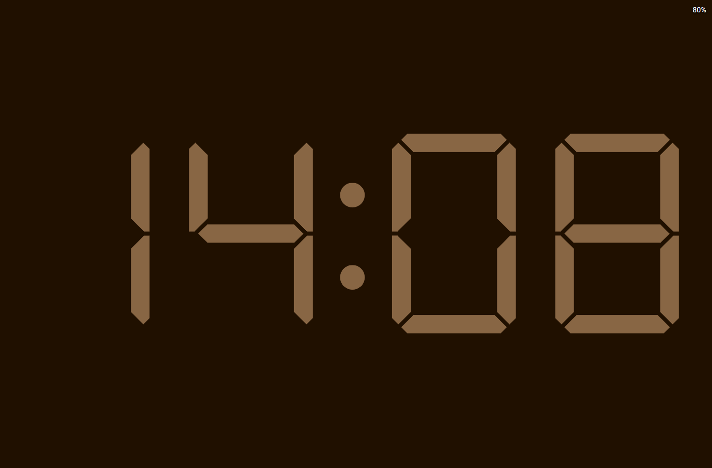
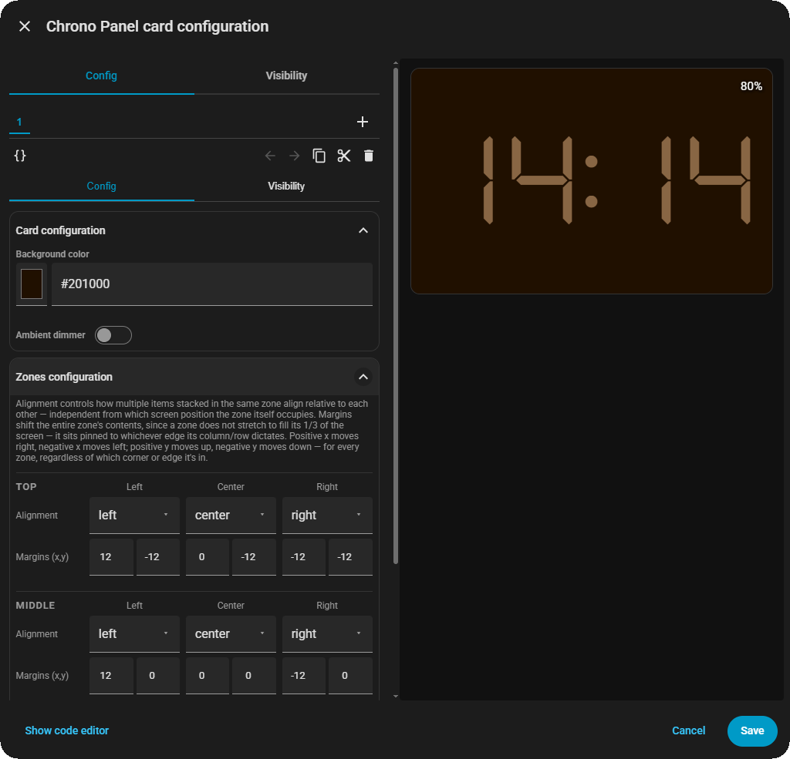

 <div align="center">

  [](https://github.com/hacs/integration)
  [](https://www.gnu.org/licenses/agpl-3.0)
  [](https://github.com/rob-vandenberg/chrono-tile-card/releases)

  

  

  <p align="center">
    <strong>A freeform tile for entities and templates.<br>
            Place items anywhere in a 9-zone grid, styled exactly how you want.<br>
            Add an ambient-light dimmer for wall-mounted tablets.</strong>
  </p>

  <p align="center">
    <a href="#introduction">Introduction</a> •
    <a href="#key-features">Key Features</a> •
    <a href="#installation">Installation</a> •
    <a href="#usage">Usage</a> •
    <a href="#license">License</a>
  </p>

</div>

---

**Chrono Tile Card** splits the card into a 3×3 grid of zones - top, middle, and bottom rows, each with a left, center, and right position. You place items into those zones: entity items that show an icon and/or state, or template items that show any Jinja2 template you write. Every item can be styled on its own - font, color, size, background, shadow - and every zone can be nudged into exactly the spot you want.

---

## 📋 Table of Contents

- [Introduction](#introduction)
- [Key Features](#key-features)
- [Installation](#installation)
  - [HACS (Recommended)](#hacs-recommended)
  - [Manual Installation](#manual-installation)
- [Uninstallation](#uninstallation)
- [Usage](#usage)
  - [Adding the Card](#adding-the-card)
  - [Card Options](#card-options)
  - [Item Options](#item-options)
  - [Gestures and Actions](#gestures-and-actions)
  - [The Ambient Dimmer](#the-ambient-dimmer)
- [Limitations](#limitations)
- [License](#license)
- [Support](#support)

---

## 🚀 Key Features

### 🧩 A 9-Zone Grid
Every card has 9 zones - 3 rows × 3 columns. Put as many items as you like into any zone, and they'll stack neatly.

### 🎯 Two Kinds of Items
Show a live entity (icon and/or state), or write a Jinja2 template for anything else - a custom string, a calculation, a combination of sensors.

### 🎨 Style Every Item Individually
Font, size, weight, color, background, padding, margins, border radius, and a full text-shadow/stroke system. Every item can look completely different from the next.

### 📍 Fine-Tune Every Zone
Each zone has its own alignment and X/Y offset, so you can nudge a group of items exactly where you want them, right down to the pixel.

### 👆 Every Gesture, Every Direction
Tap, hold, double-tap, and swipe in all 4 directions - each one can trigger its own action, on the card or on an individual item.

### 🌙 Ambient-Light Dimmer
Got a wall-mounted tablet that's too bright at night? Link a lux sensor and the card dims itself automatically, with a curve you control.

### 🎛️ Full Visual Editor
Add items, style them, and position zones, all without touching YAML.

---

## 📦 Installation

### HACS (Recommended)

1. Open **HACS** in your Home Assistant instance.
2. Navigate to **Frontend** and click the three-dot menu in the top right corner.
3. Select **Custom repositories**.
4. Enter `https://github.com/rob-vandenberg/chrono-tile-card` and select **Lovelace** as the category.
5. Click **Add**. The repository will appear in the list.
6. Search for `Chrono Tile Card` and click **Download**.
7. Reload your browser.

### Manual Installation

1. Download `chrono-tile-card.js` from the [latest release](https://github.com/rob-vandenberg/chrono-tile-card/releases/latest).
2. Copy it to your Home Assistant `config/www/` folder.
3. In Home Assistant, go to **Settings → Dashboards → Resources**.
4. Click **Add Resource**.
5. Enter `/local/chrono-tile-card.js` as the URL and select **JavaScript Module**.
6. Click **Create** and reload your browser.

---

## 🗑️ Uninstallation

### Via HACS
1. Open **HACS → Frontend**.
2. Find **Chrono Tile Card** and click the three-dot menu.
3. Select **Remove**.
4. Reload your browser.

### Manual
1. Delete `chrono-tile-card.js` from `config/www/`.
2. Remove the resource entry from **Settings → Dashboards → Resources**.
3. Remove any cards using `chrono-tile-card` from your dashboards.

---



---

## ⚙️ Usage

### Adding the Card

1. Open a dashboard and click **Edit Dashboard**.
2. Click **Add Card**.
3. Search for **Chrono Tile Card**.
4. Click **+ Add entity** or **+ Add template** to add your first item.
5. Pick a zone for it, then style it however you like.



If you'd rather write YAML directly, here's a small example with one entity item and one template item:

```yaml
type: custom:chrono-tile-card
background_color: "#000000"
items:
  - entity: sensor.living_room_temperature
    vertical: top
    horizontal: left
    show_icon: true
    show_state: true
    font_size: 1.2
    font_color: "#FFFFFF"
  - template: '{{ now().strftime("%H:%M") }}'
    vertical: bottom
    horizontal: right
    font_family: "DSEG7 Classic"
    font_size: 2
    font_color: "#00FF00"
```

### Card Options

These go at the top level of the card config.

| Key | Type | Default | What it does |
| :--- | :--- | :--- | :--- |
| `background_color` | color | `#000000` | The card's flat background color. |
| `items` | list | `[]` | The entity and template items placed on the card. See [Item Options](#item-options). |
| `zone_alignment` | map | see below | How items stack within each zone: `left`, `center`, or `right`. Keyed by zone, e.g. `top-left`. Defaults to matching each zone's own column. |
| `zone_offset_x` | map | see below | How far each zone shifts horizontally, in pixels. Positive is right, negative is left. |
| `zone_offset_y` | map | see below | How far each zone shifts vertically, in pixels. Positive is up, negative is down. |
| `tap_action` | action | more-info* | What happens when you tap the card itself (not an item). |
| `hold_action` | action | (none) | What happens when you press and hold the card. |
| `double_tap_action` | action | (none) | What happens when you tap the card twice quickly. |
| `swipe_up_action` | action | (none) | What happens when you swipe up on the card. |
| `swipe_down_action` | action | (none) | What happens when you swipe down on the card. |
| `swipe_left_action` | action | (none) | What happens when you swipe left on the card. |
| `swipe_right_action` | action | (none) | What happens when you swipe right on the card. |

\* Only applies when the tap lands on empty space, not on an item - items resolve their own tap action first.

`zone_alignment`, `zone_offset_x`, and `zone_offset_y` are each keyed by zone name: `top-left`, `top-center`, `top-right`, `middle-left`, `middle-center`, `middle-right`, `bottom-left`, `bottom-center`, `bottom-right`. You won't normally need to edit these directly - the editor's zone controls handle it for you.

### Item Options

Each entry in `items` is either an entity item (has an `entity` key) or a template item (has a `template` key).

| Key | Type | Default | What it does |
| :--- | :--- | :--- | :--- |
| `entity` | text | - | The entity to show. Entity items only. |
| `template` | text | - | A Jinja2 template, e.g. `{{ states("sensor.temp") }}`. Template items only. |
| `show` | `true`/`false` | `true` | Shows or hides this item. |
| `vertical` | text | `middle` | Which row: `top`, `middle`, or `bottom`. |
| `horizontal` | text | `center` | Which column: `left`, `center`, or `right`. |
| `show_icon` | `true`/`false` | `true` | Shows the entity's icon. Entity items only. |
| `icon` | text | (none) | Overrides the entity's default icon. Entity items only. |
| `icon_size` | number | `24` | Icon size, in pixels. Entity items only. |
| `show_state` | `true`/`false` | `false` | Shows the entity's state as text. Entity items only. |
| `attribute` | text | (none) | Shows this attribute instead of the entity's state. Entity items only. |
| `prefix` / `suffix` | text | (none) | Text added before/after the attribute value. Entity items only. |
| `font_color` | color | `#FFFFFF` | Text (and icon) color. |
| `font_family` | text | `DSEG7 Classic` | Pick from a curated list of fonts in the editor, including two segmented "digital clock" styles. |
| `font_size` | number | `1` | Font size, in `em`. |
| `font_weight` | number | `400` | Font weight (100-900). |
| `line_height` | number | (theme default) | Line height. |
| `background_color` | color | (none) | Background color behind the item. |
| `border_radius` | number | (none) | Corner rounding, in pixels. |
| `padding_horizontal` / `padding_vertical` | number | (none) | Inner spacing around the item's content. |
| `margin_top` / `margin_bottom` | number | (none) | Spacing between this item and its neighbors in the same zone. |
| `text_shadow_color` | color | (none) | Enables a text shadow when set. |
| `text_shadow_blur` | number | (none) | Shadow blur radius. |
| `text_shadow_offset_x` / `text_shadow_offset_y` | number | (none) | Shadow offset. |
| `text_shadow_stroke_width` | number | (none) | Adds an outline stroke around the text, independent of the shadow. |
| `tap_action` | action | more-info** | What happens when you tap this item. |
| `hold_action` | action | (none) | What happens when you press and hold this item. |
| `double_tap_action` | action | (none) | What happens when you tap this item twice quickly. |

\** Entity items open the more-info dialog by default, matching Home Assistant's own cards. Set `tap_action: { action: none }` to turn this off. Template items have no default tap action.

Using a key that isn't in this list, or a value that isn't valid, won't break the card - it's just ignored.

### Gestures and Actions

The card recognizes tap, hold, double-tap, and swipe (in all 4 directions), both on individual items and on the card as a whole. Any of Home Assistant's standard actions can be used - `more-info`, `navigate`, `call-service`, `toggle`, `url`, `none`, and so on.

Swipes are always read from the whole card, no matter which item they start on - useful as a "next/previous" or navigation gesture that doesn't interfere with tapping items underneath.

### The Ambient Dimmer

Turn on `dimmer_enabled` and pick a lux sensor with `dimmer_entity`, and the card overlays a semi-transparent layer that darkens as the room gets darker.

| Key | Type | Default | What it does |
| :--- | :--- | :--- | :--- |
| `dimmer_enabled` | `true`/`false` | `false` | Turns the dimmer on or off. |
| `dimmer_entity` | text | (none) | The lux (illuminance) sensor to read. |
| `dimmer_color` | color | `#000000` | The dimmer overlay's color. |
| `dimmer_lux_min` / `dimmer_lux_max` | number | `0` / `40` | The lux range the dimmer reacts to. Below the minimum, opacity is at its maximum; above the maximum, opacity is at its minimum. |
| `dimmer_opacity_min` / `dimmer_opacity_max` | number (%) | `0` / `80` | The opacity range the dimmer can move between. |
| `dimmer_aggressiveness` | number (%) | `50` | How sharply the dimmer reacts across the lux range. `50` is a natural, human-eye-like curve; lower values react more gently, higher values react more sharply. |

---

## ⚠️ Limitations

- Template items are re-evaluated by Home Assistant like any other Jinja2 template - very complex templates on many items at once may add some load to your instance.
- The dimmer needs a real lux sensor. Without `dimmer_entity` set, it stays off even if `dimmer_enabled` is `true`.
- There's no photo or slideshow background - only a flat background color. For a full-screen photo display, use a different card alongside this one.
- The DSEG "digital clock" fonts and Google Fonts are loaded from a CDN. Without an internet connection, items using them will fall back to the browser's default font.

---

## ⚖️ License

**GNU Affero General Public License v3.0 (AGPL-3.0)**

This project is licensed under the AGPL-3.0. You are free to use, modify, and distribute this software, provided that any modifications or derivative works that are made available — including over a network — are also distributed under the same license.

Full license text: [https://www.gnu.org/licenses/agpl-3.0](https://www.gnu.org/licenses/agpl-3.0)

Copyright © 2026 Rob Vandenberg. All rights reserved.

---

## ☕ Support

If you find this project useful and wish to support its continued development, please consider a contribution.

[](https://www.buymeacoffee.com/robvandenberg)
